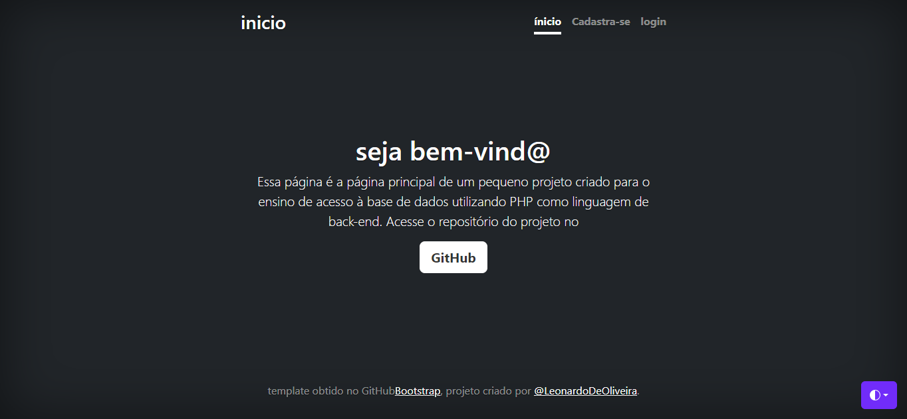
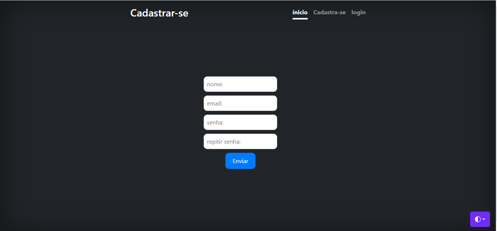
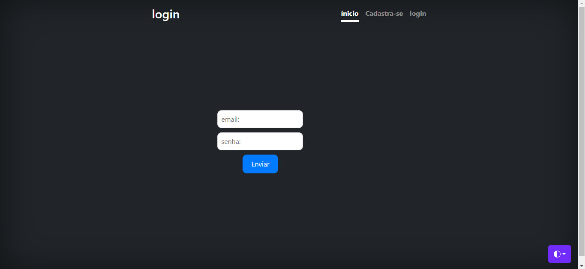

# 🚀 sejam todos bem vindo ao meu repositorio 

## indice
   - [Formulário de login e cadastro](#formul%C3%A1rio-de-login-e-cadastro)  
   - [Descrição](#descris%C3%A3o)  
   - [Introdução](#introdu%C3%A7%C3%A3o)  
   - [Funcionalidades](#funcionalidades)  
   - [Tecnologias Utilizadas](#tecnologias-utilizadas)  
   - [Fontes Consultadas](#fontes-consultadas)  
   - [Autores](#autores)  

# 💰Formulário de login e cadastro

# ✅Descrisão 
esse código foi feito com bootstrap5 usando o modelo cover modifiquei ele para virar uma tela de cadastro

# 📃 Introdução

nesse formulario de cadastro tem 2 opções:
cadastrar-se como novo usuario

login de antigo usuario

   
## 🔧 Funcionalidades
   °Permite que o usurio visite meu perfil no github.   
   °faz login ou cadastro.   
   °SubMenus que alternam as páginas uma da outra.

## as linguagens utilizadas servem para:

   index.php: Página principal do projeto.   
   login.php: Página de login.   
   cad.php: página de cadastro.   

## 📌 Tecnologias Utilizadas
   °HTML5    
   °CCS3   
   °PHP8.1   
## 🔎 Fontes consultadas
   [Bootstrap](https://getbootstrap.com/)  
   
## ✒️ Autores
[Leonardo De Oliveira](https://github.com/leoOliveiraBR)  
